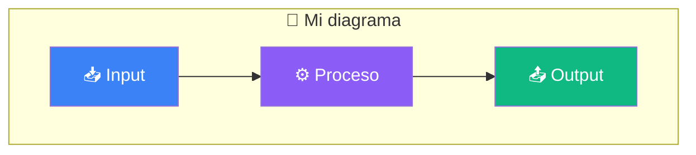

# 🎨 Guía de estilo — Digital Brain

> Convenciones para mantener consistencia en toda la documentación.

---

## 1️⃣ Títulos y jerarquía

```markdown
# Título principal (H1) — Solo 1 por documento

## Subtítulo (H2) — Secciones principales

### Subsección (H3) — Dentro de una sección

#### Detalle (H4) — Solo si es necesario
```

**Reglas:**
- Usa **1 solo H1** por documento
- No saltes niveles (H1 → H3 sin H2)
- No uses negritas como títulos

---

## 2️⃣ Iconos y emojis

| Elemento | Icono |
|---|---|
| Introducción | 🧠 |
| Instalación | 📥 |
| Configuración | ⚙️ |
| Prompts | 🤖 |
| Casos de uso | 🎯 |
| MCP | 🔌 |
| Troubleshooting | 🛠️ |
| Paso/siguiente | ➡️ |
| Tip/nota | 💡 |
| Advertencia | ⚠️ |
| Error | ❌ |
| Éxito | ✅ |

**Reglas:**
- Coloca el icono **antes del título**: `## 📥 Instalación`
- No abuses de iconos en medio del texto
- Usa callouts para notas importantes:

```markdown
> 💡 **Tip:** Una recomendación útil.

> ⚠️ **Atención:** Algo importante que no debe pasarse por alto.

> ❌ **Error común:** Problema frecuente y cómo evitarlo.

> ✅ **Éxito:** Confirmación de que algo funciona.
```

---

## 3️⃣ Formato de código

```markdown
# Comandos de terminal (bash)
```bash
npm install -g @anthropic-ai/claude-code
```

# Archivos de configuración (yaml/json)
```yaml
vault_path: "/ruta/al/vault"
```

# Código en línea
Usa `claude --version` para verificar la instalación.
```
```

**Reglas:**
- Siempre especifica el lenguaje después de ` ``` `
- Usa bloques de código para 2+ líneas
- Usa código en línea `` para comandos cortos
- Prefiere `$` como prompt de terminal (opcional)

---

## 4️⃣ Tablas

```markdown
| Izquierda | Centro | Derecha |
|---|---|---|
| Texto | Texto | Texto |
```

**Reglas:**
- Alinea correctamente con `---`, `:---`, `---:`, `:---:`
- No uses tablas para layouts complejos
- Agrega un blank line antes y después de cada tabla

---

## 5️⃣ Enlaces

```markdown
# Enlace a otro documento de la guía
[texto](./archivo.md)

# Enlace a sección dentro del mismo documento
[texto](#seccion)

# Enlace externo
[texto](https://ejemplo.com)
```

**Reglas:**
- Usa rutas relativas para enlaces internos
- Los enlaces internos siempre con `./`
- Verifica que los enlaces no estén rotos (`make validate-links`)

---

## 6️⃣ Nomenclatura de archivos

```
# Documentación
docs/01-introduccion.md        # 01- prefijo numérico para orden
docs/02-instalacion.md
docs/glosario.md               # Sin prefijo si es complementario
docs/cheatsheet.md

# Prompts
prompts/procesar-entrada.md     # kebab-case descriptivo
prompts/generar-insights.md

# Templates
templates/nota-permanente.md    # kebab-case
templates/nota-diaria.md

# Configuración
config/harness-config.yaml      # kebab-case
config/mcp-server.js
```

**Reglas:**
- Usa `kebab-case` (guiones, no espacios ni underscores)
- Prefijos numéricos solo en `docs/` para orden de lectura
- Sin caracteres especiales ni espacios

---

## 7️⃣ Front matter

Todos los archivos `.md` deben incluir front matter YAML:

```yaml
---
title: "Nombre del documento"
description: "Resumen de 1-2 oraciones"
tags: [documentacion, digital-brain]
sidebar_position: 1
---
```

**Campos obligatorios:**
- `title` — Título del documento

**Campos opcionales:**
- `description` — Para búsqueda y previews
- `tags` — Para filtrado y categorización
- `sidebar_position` — Posición en sidebar (solo docs/)

---

## 8️⃣ Diagramas Mermaid

Usa el mismo estilo en todos los diagramas:



**Paleta de colores Mermaid:**

| Rol | Color | Hex |
|---|---|---|
| Proceso principal | Azul | `#3B82F6` |
| IA / Claude | Púrpura | `#8B5CF6` |
| Almacenamiento | Verde | `#10B981` |
| Usuario | Naranja | `#F59E0B` |
| Error/Advertencia | Rojo | `#EF4444` |

---

## 9️⃣ Callouts y notas

| Tipo | Formato | Color |
|---|---|---|
| 💡 Tip | `> 💡 **Tip:** ...` | Azul |
| ⚠️ Atención | `> ⚠️ **Atención:** ...` | Amarillo |
| ❌ Error | `> ❌ **Error:** ...` | Rojo |
| ✅ Éxito | `> ✅ **Éxito:** ...` | Verde |
| 📝 Nota | `> 📝 **Nota:** ...` | Gris |

---

## 🔟 Checklist

Usa checklists para pasos y requisitos:

```markdown
- [ ] ✅ Tarea pendiente
- [x] ✅ Tarea completada
```

Siempre marca las tareas completadas con `[x]` y agrega el icono ✅ para visibilidad.
