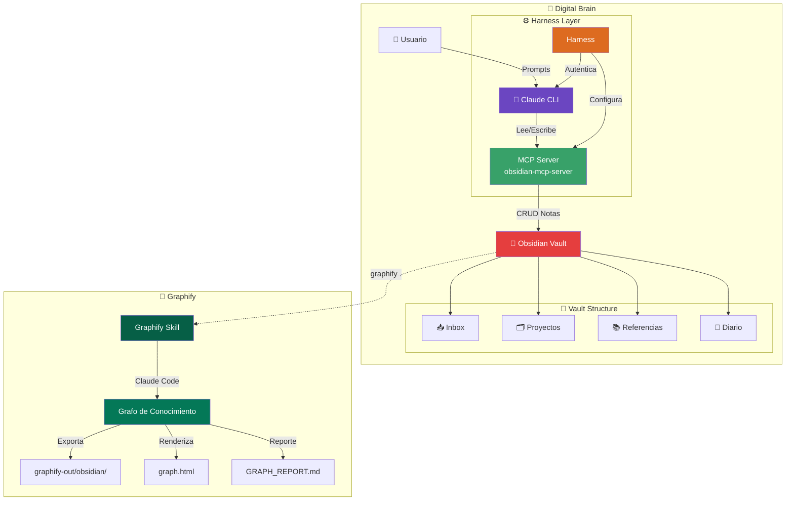

# 🧠 Introducción: ¿Qué es un Digital Brain?

> Aprende los fundamentos del sistema: cómo funciona, sus componentes y el flujo de trabajo.

## 📋 Tabla de contenidos

- [🌟 Concepto](#-concepto)
- [🤔 ¿Por qué necesitas esto?](#-por-qué-necesitas-esto)
- [🔧 Componentes del sistema](#-componentes-del-sistema)
- [🔄 Flujo de trabajo típico](#-flujo-de-trabajo-típico)
- [🎯 ¿Para quién es esto?](#-para-quién-es-esto)
- [📐 Diagrama de arquitectura](#-diagrama-de-arquitectura)

---

## 🌟 Concepto

Un **Digital Brain** (cerebro digital) es un sistema donde:

- **Obsidian** almacena todo tu conocimiento como notas conectadas
- **Claude CLI** actúa como tu asistente de IA para procesar información
- **MCP** es el puente que comunica a Claude con Obsidian

```
┌────────────────────────────────────────────────────┐
│              TU CEREBRO DIGITAL                    │
│                                                    │
│   ┌──────────────┐      ┌──────────────┐           │
│   │   Claude     │      │   Obsidian   │           │
│   │   (Mente)    │◄────►│   (Memoria)  │           │
│   └──────────────┘      └──────────────┘           │
│          ▲                      ▲                  │
│          │    ┌────────────┐    │                  │
│          └────┤ MCP Server │────┘                  │
│               │  (Puente)  │                       │
│               └────────────┘                       │
└────────────────────────────────────────────────────┘
```

---

## 🤔 ¿Por qué necesitas esto?

| Problema                         | Solución                                   |
| -------------------------------- | ------------------------------------------ |
| 📚 Tienes mil notas dispersas    | Claude las organiza automáticamente        |
| 🔗 No conectas ideas entre temas | Claude encuentra conexiones ocultas        |
| 🕐 Pierdes tiempo buscando info  | Claude responde al instante desde tu vault |
| 💡 Olvidas insights importantes  | Claude los extrae y los guarda             |

---

## 🔧 Componentes del sistema

### 📓 1. Obsidian — Tu memoria externa

Obsidian es una aplicación de notas que trabaja con archivos Markdown locales. Es perfecta porque:

- ✅ Tus datos son tuyos (archivos `.md` locales)
- ✅ Soporta links entre notas (como un wiki personal)
- ✅ Tiene miles de plugins
- ✅ Es rápida y liviana

### 🤖 2. Claude CLI — Tu mente aumentada

Claude CLI es la interfaz de línea de comandos de Claude (Anthropic). Con ella puedes:

- ✅ Procesar grandes cantidades de texto
- ✅ Analizar y resumir información
- ✅ Generar nuevas conexiones entre ideas
- ✅ Mantener contexto en conversaciones largas

### 🔌 3. MCP (Model Context Protocol) — El puente

MCP es como el **USB-C de la IA**: un estándar para que los modelos de lenguaje se conecten con herramientas externas. En nuestro caso:

- Claude (el cliente MCP) le habla al MCP Server
- El MCP Server lee y escribe en tu vault de Obsidian
- Claude puede buscar, crear y modificar notas

### ⚙️ 4. Harness — El orquestador

El Harness es el gestor que mantiene todo funcionando:

- Inicia el MCP Server cuando lo necesitas
- Configura las rutas correctas
- Gestiona las credenciales
- Asegura que Claude ↔ Obsidian estén siempre conectados

### 🧠 5. Graphify — Grafo de conocimiento automático

Graphify complementa el sistema generando un **grafo de conocimiento persistente** desde todo tu vault:

- Extrae automáticamente entidades y relaciones de tus notas
- Genera visualizaciones interactivas (`graph.html`)
- Exporta como vault de Obsidian navegable (`graphify-out/obsidian/`)
- Crea wiki estática publicable (`wiki/`)
- Modo `watch` para mantener el grafo sincronizado en tiempo real

> 💡 Ver integración completa en [`08-graphify-integracion.md`](./08-graphify-integracion.md)

---

## 🔄 Flujo de trabajo típico

```
📥 Llega información nueva
        │
        ▼
┌───────────────────┐
│  Claude procesa   │  ← Le pasas un artículo, idea o video
│  y extrae lo      │
│  esencial         │
└────────┬──────────┘
         │
         ▼
┌───────────────────┐
│  MCP Server       │  ← Claude le pide al MCP que guarde
│  guarda en        │     la info en Obsidian
│  Obsidian         │
└────────┬──────────┘
         │
         ▼
┌───────────────────┐
│  Claude conecta   │  ← Claude busca notas relacionadas
│  con notas        │     en tu vault y las vincula
│  existentes       │
└────────┬──────────┘
         │
         ▼
┌───────────────────┐
│  Tú obtienes      │  ← Nuevas conexiones, insights,
│  insights nuevos  │     resúmenes y organización
└───────────────────┘
```

---

## 🎯 ¿Para quién es esto?

| Perfil                | Beneficio                                                                 |
| --------------------- | ------------------------------------------------------------------------- |
| 🧑‍🎓**Estudiantes**     | Organizar apuntes, conectar temas, preparar exámenes                      |
| 👩‍💻**Desarrolladores** | Documentar proyectos, guardar snippets, aprender nuevas tecnologías       |
| ✍️**Escritores**      | Organizar investigación, conectar personajes/tramas, evitar incoherencias |
| 🔬**Investigadores**  | Gestionar papers, encontrar relaciones entre estudios                     |
| 🧑‍💼**Profesionales**   | Tomar notas de reuniones, conectar proyectos, hacer seguimiento           |

---

## 📐 Diagrama de arquitectura



---

## ➡️ Siguiente paso

⬅️ **Anterior:** — · **Siguiente:** [`02-instalacion.md`](./02-instalacion.md) 📥
