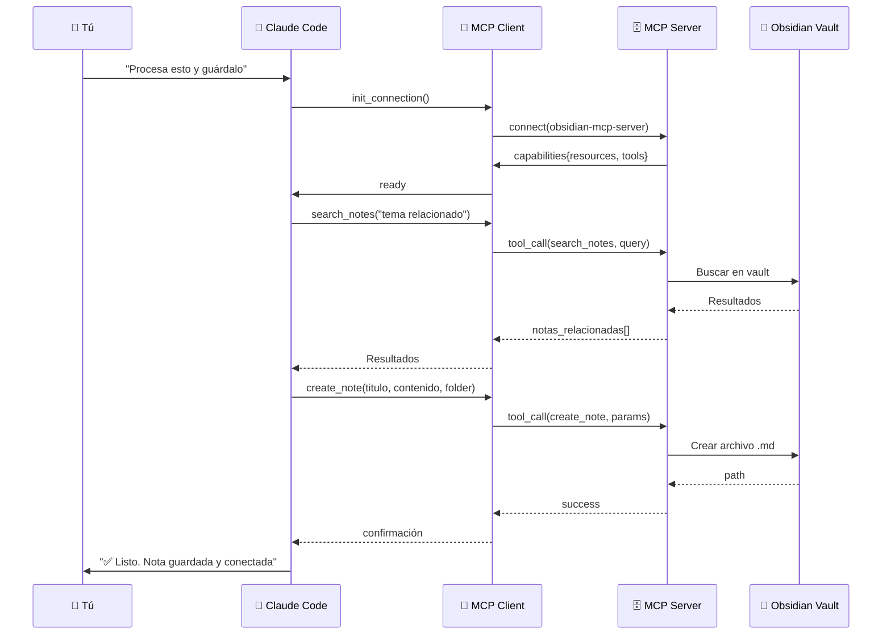

# 🔌 MCP — Model Context Protocol explicado

> El protocolo que hace posible la comunicación entre Claude y tus herramientas.

## 📋 Tabla de contenidos

- [🤔 ¿Qué es MCP?](#-qué-es-mcp)
- [🏗️ Arquitectura de MCP](#️-arquitectura-de-mcp)
- [🧩 Componentes de MCP](#-componentes-de-mcp)
- [🔄 Cómo fluye la comunicación](#-cómo-fluye-la-comunicación)
- [🛠️ Herramientas que expone nuestro MCP Server](#️-herramientas-que-expone-nuestro-mcp-server)
- [💡 Ejemplo visual del flujo MCP](#-ejemplo-visual-del-flujo-mcp)
- [🔗 MCP vs APIs tradicionales](#-mcp-vs-apis-tradicionales)
- [📐 Diagrama Mermaid](#-diagrama-mermaid)
- [🚀 ¿Qué más se puede conectar con MCP?](#-qué-más-se-puede-conectar-con-mcp)

---

## 🤔 ¿Qué es MCP?

MCP (Model Context Protocol) es un protocolo abierto creado por Anthropic que permite conectar modelos de lenguaje con **herramientas externas** y **fuentes de datos**.

**Imagínalo como el "USB-C de la IA":**

```
Sin MCP:                         Con MCP:
┌──────────┐                    ┌──────────┐    ┌──────────┐
│  Claude  │────solo texto───►  │  Claude  │◄──►│  MCP     │
│          │                    │          │    │  Server  │
└──────────┘                    └──────────┘    └────┬─────┘
                                                     │
                                             ┌───────┴───────┐
                                             │  Obsidian     │
                                             │  Filesystem   │
                                             │  Web          │
                                             │  Database     │
                                             └───────────────┘
```

---

## 🏗️ Arquitectura de MCP

```
┌───────────────────────────────────────────────────────┐
│                    MCP Architecture                   │
│                                                       │
│  ┌──────────────────┐                                 │
│  │   MCP Host       │                                 │
│  │  (Claude Code)    │                                 │
│  │                  │                                 │
│  │  ┌─────────────┐ │                                 │
│  │  │ MCP Client  │─┼───────┐                         │
│  │  └─────────────┘ │       │                         │
│  └──────────────────┘       │                         │
│                             ▼                         │
│                    ┌──────────────────┐               │
│                    │   MCP Server     │               │
│                    │  (obsidian)      │               │
│                    │                  │               │
│                    │  ┌────────────┐  │               │
│                    │  │ Resources  │──┼──► Obsidian   │
│                    │  │ Tools      │──┼──► Notas      │
│                    │  │ Prompts    │  │               │
│                    │  └────────────┘  │               │
│                    └──────────────────┘               │
└───────────────────────────────────────────────────────┘
```

---

## 🧩 Componentes de MCP

### 1. 🖥️ MCP Host

El programa que **inicia la conexión**. En nuestro caso es **Claude Code**.

- Es quien tiene la sesión del modelo de lenguaje
- Contiene un MCP Client interno
- Gestiona múltiples servidores MCP

### 2. 📡 MCP Client

Vive dentro del Host. Es quien:

- Establece la conexión con el servidor
- Envía las peticiones (lista notas, lee nota, escribe nota)
- Recibe las respuestas

### 3. 🗄️ MCP Server

El programa que **expone recursos y herramientas**. En nuestro caso es el servidor que conecta con Obsidian.

Proporciona tres tipos de capacidades:

#### 📄 Resources (Recursos)

Datos que Claude puede **leer**. Ejemplos:

- Contenido de una nota
- Lista de archivos en una carpeta
- Metadatos de notas

```json
// Ejemplo: leer un recurso
GET resource://obsidian/notas/mi-nota.md
→ { content: "# Mi nota\nContenido..." }
```

#### 🛠️ Tools (Herramientas)

Acciones que Claude puede **ejecutar**. Ejemplos:

- Crear una nueva nota
- Buscar texto en el vault
- Mover archivos

```json
// Ejemplo: ejecutar una herramienta
CALL tool://obsidian/create_note
  params: { title: "Nueva idea", content: "..." }
→ { success: true, path: "Inbox/nueva-idea.md" }
```

#### 📝 Prompts (Plantillas)

Plantillas de prompts reutilizables que el servidor ofrece al modelo.

---

## 🔄 Cómo fluye la comunicación

```
  Tú                     Claude                    MCP Server              Obsidian
  │                        │                          │                      │
  │ "Busca notas sobre IA" │                          │                      │
  │───────────────────────►│                          │                      │
  │                        │                          │                      │
  │                        │  list_resources()        │                      │
  │                        │─────────────────────────►│                      │
  │                        │                          │  Lee archivos        │
  │                        │                          │─────────────────────►│
  │                        │                          │◄─────────────────────│
  │                        │◄─────────────────────────│                      │
  │                        │                          │                      │
  │                        │  read_resource()         │                      │
  │                        │─────────────────────────►│                      │
  │                        │                          │  Lee contenido       │
  │                        │                          │─────────────────────►│
  │                        │                          │◄─────────────────────│
  │                        │◄─────────────────────────│                      │
  │                        │                          │                      │
  │ "Encontré 3 notas..."  │                          │                      │
  │◄───────────────────────│                          │                      │
```

---

## 🛠️ Herramientas que expone nuestro MCP Server

Cuando ejecutas el servidor MCP, Claude puede usar estas herramientas:

| Herramienta       | Descripción                  | Ejemplo                                       |
| ----------------- | ---------------------------- | --------------------------------------------- |
| `list_notes`      | Lista notas en una carpeta   | `list_notes(folder="Inbox/")`                 |
| `read_note`       | Lee el contenido de una nota | `read_note(path="mi-nota.md")`                |
| `create_note`     | Crea una nueva nota          | `create_note(title="Insight", content="...")` |
| `update_note`     | Actualiza una nota existente | `update_note(path="...", content="...")`      |
| `delete_note`     | Elimina una nota             | `delete_note(path="...")`                     |
| `search_notes`    | Busca texto en el vault      | `search_notes(query="machine learning")`      |
| `get_vault_stats` | Estadísticas del vault       | `get_vault_stats()`                           |

---

## 💡 Ejemplo visual del flujo MCP

```
  Tú: "Claude, guarda esta idea sobre blockchain en mi vault"

  ┌── Claude recibe el mensaje ───────────────────────────┐
  │                                                       │
  │  1. Claude decide: "Necesito guardar esto en          │
  │     Obsidian"                                         │
  │                                                       │
  │  2. Claude llama a la herramienta create_note:        │
  │     → MCP Client envía:                               │
  │       POST /tools/create_note                         │
  │       { "title": "Blockchain idea",                   │
  │         "content": "# Blockchain\nIdea sobre...",     │
  │         "folder": "Inbox" }                           │
  │                                                       │
  │  3. MCP Server recibe → la procesa →                  │
  │     crea el archivo en Obsidian                       │
  │                                                       │
  │  4. MCP Server responde:                              │
  │     { "success": true,                                │
  │       "path": "Inbox/blockchain-idea.md" }            │
  │                                                       │
  │  5. Claude te dice: "✅ Guardado en Inbox/"           │
  └───────────────────────────────────────────────────────┘
```

---

## 🔗 MCP vs APIs tradicionales

| Aspecto            | MCP                           | API tradicional       |
| ------------------ | ----------------------------- | --------------------- |
| 🔌 Conexión        | Protocolo estándar            | Cada API es diferente |
| 🎯 Propósito       | IA primero                    | Humano primero        |
| 📦 Descubrimiento  | El servidor anuncia sus tools | Documentación externa |
| 🔄 Estado          | Sesión persistente            | Sin estado            |
| 🛠️ Tools dinámicas | Se registran al conectar      | Endpoints fijos       |

---

## 📐 Diagrama Mermaid



---

## 🚀 ¿Qué más se puede conectar con MCP?

Además de Obsidian, MCP puede conectar Claude con:

| Herramienta         | Para qué                           |
| ------------------- | ---------------------------------- |
| 📁**Filesystem**    | Leer/escribir archivos locales     |
| 🌐**Web**           | Buscar en internet, hacer scraping |
| 🗄️**Base de datos** | Consultar SQL directamente         |
| 📊**Google Sheets** | Leer y escribir en spreadsheets    |
| 🐙**GitHub**        | Gestionar repos, issues, PRs       |
| 📧**Email**         | Leer y enviar correos              |
| 🎨**Figma**         | Obtener información de diseños     |

---

> 💡 **Tip:** MCP no es exclusivo de Obsidian. El mismo protocolo puedes usarlo para conectar Claude con bases de datos, GitHub, archivos locales, etc.

## ➡️ Siguiente paso

⬅️ **Anterior:** [`01-introduccion.md`](./01-introduccion.md) 🧠 · **Siguiente:** [`03-harness.md`](./03-harness.md) 🎛️
