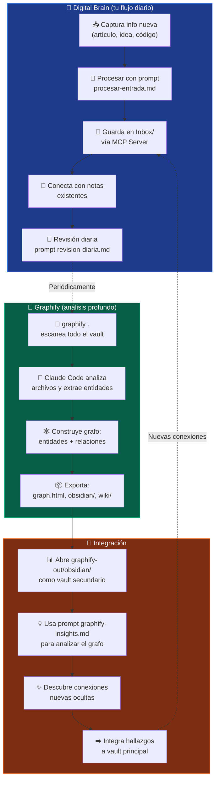
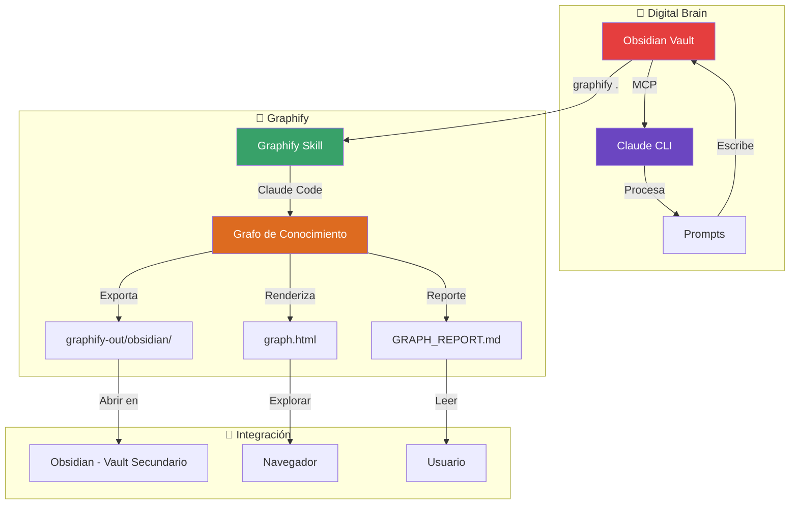

# 🧠 Graphify — Grafo de conocimiento automatizado

> Graphify genera un grafo de conocimiento persistente desde tu código, docs, imágenes y esquemas SQL. Úsalo con Claude Code para conectar ideas a través de proyectos.

## 📋 Tabla de contenidos

- [🤔 ¿Qué es Graphify?](#-qué-es-graphify)
- [⚙️ Instalación](#️-instalación)
- [🚀 Comandos básicos](#-comandos-básicos)
- [📦 Outputs que genera](#-outputs-que-genera)
- [🔗 Integración con Digital Brain](#-integración-con-digital-brain)
- [📐 Arquitectura del flujo](#-arquitectura-del-flujo)
- [⚖️ Digital Brain sin Graphify vs con Graphify](#️-digital-brain-sin-graphify-vs-con-graphify)
- [💡 Tips y buenas prácticas](#-tips-y-buenas-prácticas)

---

## 🤔 ¿Qué es Graphify?

**Graphify** es un skill para Claude Code (la versión agente de Claude CLI) que construye automáticamente un **grafo de conocimiento** a partir del contenido de una carpeta.

```
Sin Graphify:                       Con Graphify:
┌───────────────────┐               ┌───────────────────┐
│  Archivos sueltos │               │    Grafo vivo     │
│                   │               │                   │
│  📄 Código        │               │   Código ───► Doc │
│  📄 Docs          │               │      │            │
│  📄 Imágenes      │    Graphify   │      ▼            │
│  📄 SQL           │ ────────────► │    Imagen ─► SQL  │
│  📄 Notas         │               │      │            │
│  ...              │               │      ▼            │
│  (aislados)       │               │    Notas ──► ...  │
└───────────────────┘               │  (todo conectado) │
                                    └───────────────────┘
```

Procesa el contenido con Claude, extrae entidades y relaciones, y genera un grafo que puedes explorar en HTML, Obsidian o Wikipedia-like wiki.

---

## ⚙️ Instalación

### Requisitos

- Python 3.10 o superior
- Claude Code instalado (`npm install -g @anthropic-ai/claude-code`)
- Node.js 18+

### Instalar Graphify

```bash
# 1. Instalar el paquete Python
pip install graphifyy

# 2. Instalar el skill en Claude Code
graphify install

# 3. Verificar que quedó instalado
graphify status
```

> 💡 **Tip:** El paquete en PyPI se llama `graphifyy` (con dos `y`) como nombre temporal. El comando CLI sigue siendo `graphify`.

---

## 🚀 Comandos básicos

| Comando            | Descripción                                                            |
| ------------------ | ---------------------------------------------------------------------- |
| `graphify .`       | Escanea la carpeta actual y genera el grafo de conocimiento            |
| `graphify watch`   | Modo vigilancia: regenera el grafo automáticamente al detectar cambios |
| `graphify status`  | Muestra el estado del skill y la configuración actual                  |
| `graphify install` | Instala el skill en Claude Code                                        |
| `graphify --help`  | Muestra ayuda completa de todos los comandos                           |

### Uso típico

```bash
# Dentro de tu proyecto o vault
cd /ruta/a/tu/vault
graphify .
```

Esto escaneará todo el contenido, lo procesará con Claude, y generará el grafo en una carpeta `graphify-out/`.

---

## 📦 Outputs que genera

Graphify produce esta estructura de salida:

```
graphify-out/
├── graph.html          ← Visualización HTML interactiva del grafo
├── graph.json          ← Grafo en JSON (entidades y relaciones)
├── GRAPH_REPORT.md     ← Reporte legible con estadísticas del grafo
├── obsidian/           ← Vault de Obsidian con el grafo como notas
│   ├── entities/       ← Cada entidad es una nota .md
│   └── relationships/  ← Relaciones entre entidades
├── wiki/               ← Wiki navegable en HTML
│   ├── index.html
│   └── ...
└── cache/              ← Cache para regeneraciones rápidas
    └── ...
```

### ¿Para qué sirve cada uno?

| Output            | Utilidad                                                            |
| ----------------- | ------------------------------------------------------------------- |
| `graph.html`      | Explorar visualmente el grafo en el navegador                       |
| `graph.json`      | Alimentar otras herramientas o análisis programáticos               |
| `GRAPH_REPORT.md` | Leer un resumen rápido del grafo                                    |
| `obsidian/`       | Abrirlo como vault de Obsidian independiente para navegar entidades |
| `wiki/`           | Publicar como wiki estática (GitHub Pages, etc.)                    |

---

## 🔗 Integración con Digital Brain

Graphify y el Digital Brain son **complementarios**, no excluyentes:

```
Digital Brain                          Graphify
─────────────────                      ─────────
🧠 Claude CLI + MCP                    🤖 Claude Code + Skill
📓 Obsidian (tu vault principal)       📊 Grafo de conocimiento
🔗 Conexiones manuales + MOC          🔗 Conexiones automáticas
📝 Notas procesadas por prompts        🏗️ Grafo generado desde archivos
```

### Flujo recomendado

```
┌─────────────────────────────────────────────────────────────┐
│                    FLUJO INTEGRADO                          │
│                                                             │
│  ①  Trabajas normalmente en tu vault de Obsidian           │
│                                                             │
│  ②  Cuando quieras ver el panorama completo:               │
│      ─────────────────────────────                          │
│      cd /ruta/a/tu/vault                                    │
│      graphify .                                             │
│                                                             │
│  ③  Graphify genera el grafo en graphify-out/              │
│                                                             │
│  ④  Abres graphify-out/obsidian/ como vault secundario     │
│      en Obsidian (o usas graph.html en el navegador)        │
│                                                             │
│  ⑤  Usas el prompt graphify-insights para que Claude       │
│      analice el grafo y encuentre conexiones nuevas         │
│                                                             │
│  ⑥  Las conexiones descubiertas las integras de vuelta     │
│      a tu vault principal                                   │
└─────────────────────────────────────────────────────────────┘
```

### Diagrama visual del flujo integrado



### Uso con el prompt de insights

```bash
# Generar el grafo
cd ~/digital-brain
graphify .

# Usar Claude con el prompt especializado
claude "$(cat prompts/graphify-insights.md)"
```

---

## 📐 Arquitectura del flujo



---

## ⚖️ Digital Brain sin Graphify vs con Graphify

| Aspecto           | Sin Graphify                         | Con Graphify                                   |
| ----------------- | ------------------------------------ | ---------------------------------------------- |
| 🔗 Conexiones     | Manuales (links en notas, MOCs)      | Automáticas (entidades + relaciones extraídas) |
| 📊 Visibilidad    | Vista parcial por nota               | Mapa completo del conocimiento                 |
| 🏗️ Estructura     | Tesauro + MOCs + tags                | Grafo navegable + entidades + relaciones       |
| 🔄 Actualización  | Cuando ejecutas un prompt            | Automática con`graphify watch`                 |
| 📦 Contexto       | El que quepa en la ventana de Claude | Grafo comprimido (71.5x menos tokens)          |
| 🌐 Formatos       | Solo .md en Obsidian                 | HTML, Obsidian, Wiki, JSON                     |
| 🎯 Para qué sirve | Procesar información nueva día a día | Ver el panorama completo del proyecto          |

---

## 💡 Tips y buenas prácticas

> 💡 **Usa `graphify watch`** cuando estés en una sesión larga de trabajo. Así el grafo se mantiene actualizado sin que tengas que acordarte de regenerarlo.

> 💡 **El vault de Obsidian** que genera Graphify (`graphify-out/obsidian/`) puedes abrirlo como un vault independiente en Obsidian y usar sus propios plugins (Dataview, Graph View, etc.).

> 💡 **Combínalo con el prompt** de `graphify-insights.md` para que Claude lea el `GRAPH_REPORT.md` y te sugiera nuevas conexiones que luego puedes integrar a tu vault principal.

> 💡 **El grafo persiste entre sesiones** de Claude. Esto significa que puedes trabajar en un proyecto, cerrar todo, volver al día siguiente y el grafo sigue ahí con todo lo aprendido.

> 💡 **Graphify no reemplaza** los prompts del Digital Brain. Los prompts procesan información entrante; Graphify descubre la estructura del conocimiento que ya tienes.

---

## ➡️ Siguiente paso

⬅️ **Anterior:** [`07-solucion-problemas.md`](./07-solucion-problemas.md) 🛠️ · **Siguiente:** [`glosario.md`](./glosario.md) 📖
